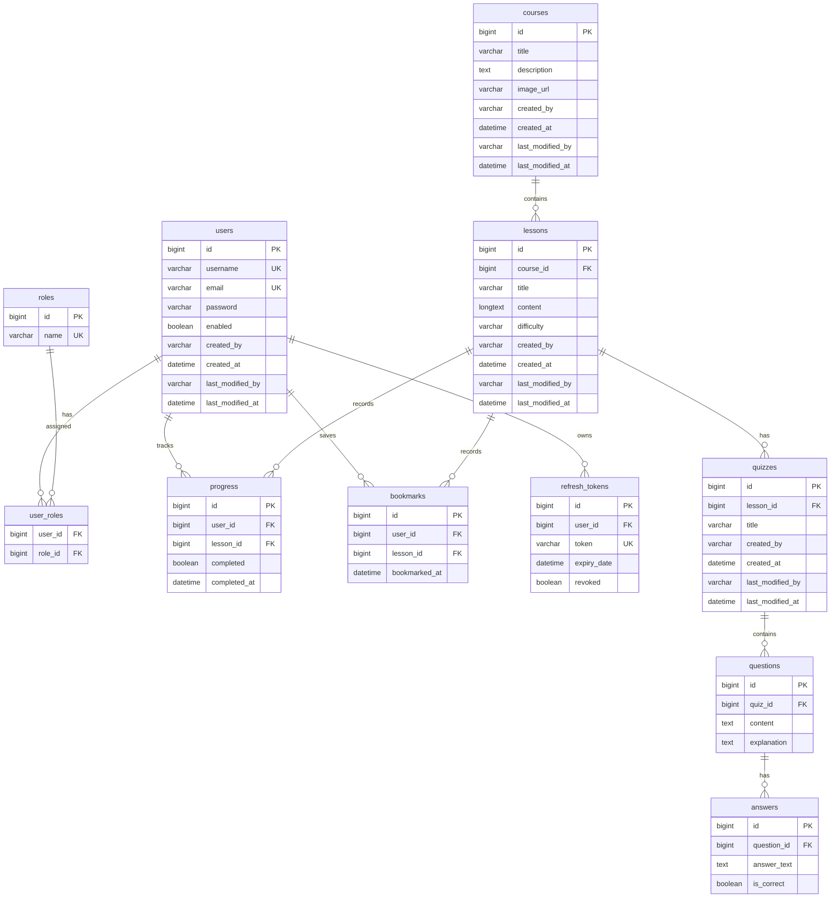

# Implementation Plan - Java Mastery Learning Platform

Xây dựng nền tảng học tập trực tuyến toàn diện về Java, cấu trúc dữ liệu và giải thuật (Java Mastery Learning Platform) dựa trên các yêu cầu nghiệp vụ và kỹ thuật đã đề ra.

## User Review Required

> [!IMPORTANT]
> **Khởi tạo dữ liệu học tập & Thư viện câu hỏi (Quiz Seeder):** 
> Hệ thống yêu cầu một thư viện lớn gồm hàng nghìn câu hỏi trắc nghiệm. Chúng tôi đề xuất xây dựng một cơ chế tự động nạp dữ liệu (`QuizSeeder` trong Spring Boot). Cơ chế này sẽ đọc dữ liệu từ các file cấu trúc (ví dụ: JSON) chứa hàng nghìn câu hỏi thuộc nhiều chủ đề (Java Core, OOP, Collections, DS&A) và tự động insert vào database khi ứng dụng khởi chạy lần đầu hoặc kích hoạt bởi Admin qua Dashboard. Phương án này linh hoạt hơn và tránh làm phình các file migration SQL của Flyway.
> 
> **Tài liệu học tập mẫu:** Chúng tôi sẽ chuẩn bị sẵn nội dung chi tiết dưới dạng Markdown cho các bài học tiêu biểu (như "Java Variables", "OOP Polymorphism", "Binary Search Tree") cùng bộ câu hỏi trắc nghiệm tương ứng để demo trực quan ngay khi hệ thống khởi chạy.

> [!IMPORTANT]
> **Phiên bản React & Thư viện UI:** Yêu cầu sử dụng React 19. Do một số thư viện như `lucide-react` hay cấu hình cũ của Shadcn UI có thể cảnh báo peer dependency với React 19, chúng tôi sẽ cấu hình cài đặt bằng flag `--legacy-peer-deps` để đảm bảo cài đặt suôn sẻ.

> [!IMPORTANT]
> **Bảo mật Refresh Token:** Để tăng cường bảo mật tránh tấn công XSS, chúng tôi đề xuất lưu trữ Refresh Token trong **HttpOnly Cookie** thay vì lưu ở LocalStorage, trong khi Access Token sẽ được trả về trong JSON body của response login.

## Resolved Decisions

- **Không phát triển Online Compiler:** Tập trung hoàn toàn vào lý thuyết và câu hỏi trắc nghiệm (Single/Multiple Choice) để tối ưu hóa trải nghiệm cốt lõi theo đúng yêu cầu.
- **Cỡ phân trang mặc định (Pagination):** Thiết lập cỡ trang mặc định là **10 bài học/trang** (và 10 mục/trang cho các danh sách khác).
- **Cấu trúc thư mục:** Di chuyển mã nguồn Spring Boot hiện tại từ `java-learning-platform/java-learning-platform` sang thư mục `backend/` của dự án để đảm bảo phân tách rõ ràng và cấu hình Docker Compose chuẩn xác.

---

## Proposed Changes

Dự án được cấu trúc thành 2 phần chính: **backend** (Spring Boot 3) và **frontend** (React + Vite + Tailwind CSS).

```
d:/Java web project/
├── backend/                  # Source code Spring Boot 3
├── frontend/                 # Source code React (Vite)
├── docker-compose.yml        # Docker compose để chạy toàn bộ hệ thống
└── implementation_plan.md    # File kế hoạch lập trình này
```

---

### 1. Database Schema Design (MySQL)

Chúng ta sẽ tạo các bảng với các trường Audit (`created_by`, `created_at`, `last_modified_by`, `last_modified_at`) và các mối quan hệ khoá ngoại.



---

### 2. Backend Component (`backend`)

Sử dụng **Spring Boot 3.5.x**, **Java 17/21**, **Spring Security**, **Spring Data JPA**, **MySQL Driver**, **Flyway** (để quản lý migration), và **MapStruct** (để map DTO).

#### Các Thư mục & File Cần Tạo:

- `src/main/java/com/javamastery/`
  - `config/`: Cấu hình Spring Security, CORS, Audit, OpenAPI Swagger, WebMvc.
  - `security/`: JWT Provider, Filter, UserDetails, Custom Authentication Entry Point.
  - `entity/`: Các Class Entity đại diện cho các bảng (User, Role, Course, Lesson, Quiz, Question, Answer, Progress, Bookmark, RefreshToken).
  - `repository/`: Các Interface JpaRepository tương ứng.
  - `dto/`: Lớp chứa dữ liệu truyền tải (Request/Response DTOs cho Auth, User, Course, Lesson, Quiz, Progress, Analytics).
  - `mapper/`: Các Interface MapStruct để ánh xạ Entity <-> DTO.
  - `service/`: Interface chứa logic nghiệp vụ và Class triển khai (`Impl`).
  - `controller/`: Các RestController cung cấp API endpoint.
  - `exception/`: GlobalExceptionHandler và các Exception tự định nghĩa (`ResourceNotFoundException`, `BadRequestException`, v.v.).
- `src/main/resources/`
  - `db/migration/`: Chứa các file SQL của Flyway (`V1__init_schema.sql`, `V2__seed_data.sql`).
  - `application.yml`: Cấu hình kết nối DB, JWT, Port, Logging.

#### [NEW] [pom.xml](file:///d:/Java%20web%20project/backend/pom.xml)
Khai báo các dependency cần thiết (Spring Web, Security, JPA, Validation, Lombok, MapStruct, OpenAPI Swagger, Flyway, MySQL).

#### [NEW] [application.yml](file:///d:/Java%20web%20project/backend/src/main/resources/application.yml)
Cấu hình Spring Boot, cổng chạy (8080), kết nối MySQL, cấu hình JWT secret và thời gian hết hạn (Access Token: 15 phút, Refresh Token: 7 ngày).

#### [NEW] [V1__init_schema.sql](file:///d:/Java%20web%20project/backend/src/main/resources/db/migration/V1__init_schema.sql)
Tạo cấu trúc bảng đầy đủ như thiết kế ERD.

#### [NEW] [SecurityConfig.java](file:///d:/Java%20web%20project/backend/src/main/java/com/javamastery/config/SecurityConfig.java)
Cấu hình phân quyền API:
- `/api/auth/**` -> permitAll
- `/api/courses/**` -> permitAll (chỉ xem bài học preview)
- Các API admin `/api/admin/**` -> có quyền `ROLE_ADMIN`
- Các API cá nhân sinh viên -> phải authenticated (`ROLE_USER` hoặc `ROLE_ADMIN`).

---

### 3. Frontend Component (`frontend`)

Sử dụng **React 19**, **Vite** làm build tool, **Tailwind CSS** để thiết kế giao diện, **Shadcn UI** làm component library, và **Axios** để giao tiếp API.

#### Giao diện chính & Component cần xây dựng:
- **Layouts**: Layout cho khách (Public Layout), Layout cho học viên có Sidebar (Dashboard Layout), Layout cho Admin Dashboard.
- **Pages**:
  - `Home`: Giới thiệu nền tảng, lộ trình học tập, danh sách các chủ đề chính (Java Basics, OOP, DS&A).
  - `Login` & `Register`: Xác thực người dùng, xử lý lưu Access Token trong bộ nhớ / Cookie.
  - `Courses`: Danh sách các khoá học/chủ đề lớn kèm tiến độ tổng quan.
  - `Lessons`: Trang đọc nội dung bài học (hiển thị Markdown rõ ràng, highlight cú pháp code Java), nút đánh dấu "Hoàn thành bài học" (để tính tiến trình) và nút "Bookmark".
  - `Quiz`: Giao diện làm bài trắc nghiệm tương tác cao. Chọn đáp án -> Nộp bài -> Hiển thị kết quả điểm số (đạt >= 70% mới hoàn thành), đáp án đúng/sai kèm giải thích cặn kẽ cho từng câu.
  - `Dashboard` (Student): Thống kê tiến độ học tập cá nhân, danh sách bài học đã bookmark, lịch sử làm quiz.
  - `Admin Dashboard`:
    - Quản lý người dùng: Danh sách tài khoản, nút khóa (Block)/mở khóa (Unblock).
    - Quản lý bài học & khóa học: Thêm/Sửa/Xóa khóa học và bài học (tích hợp trình soạn thảo Markdown).
    - Quản lý câu hỏi & Quiz: Giao diện thêm câu hỏi trắc nghiệm và câu trả lời.
    - Analytics: Biểu đồ thống kê lượng người dùng mới, tỷ lệ hoàn thành bài học, bài học phổ biến.

#### Các Thư mục & File Cần Tạo:

- `src/`
  - `components/`: UI components dùng chung (Button, Card, Input, Dialog, Toast, ThemeProvider cho Dark/Light Mode).
  - `layouts/`: `PublicLayout.jsx`, `DashboardLayout.jsx`, `AdminLayout.jsx`.
  - `pages/`: Thư mục con cho từng trang (`Home`, `Login`, `Register`, `Lessons`, `Quiz`, `StudentDashboard`, `AdminDashboard`, v.v.).
  - `services/`: Axios instance cấu hình tự động đính kèm JWT Token và xử lý Refresh Token hết hạn qua Interceptor.
  - `context/`: `AuthContext.jsx` quản lý trạng thái đăng nhập toàn cục.
  - `index.css`: Cấu hình Tailwind và biến màu sắc CSS Variable phục vụ Dark Mode (Primary `#2563EB`, Secondary `#14B8A6`, Font `Inter`).
  - `App.jsx` & `main.jsx`: Định tuyến React Router và khởi tạo ứng dụng.

---

### 4. Docker & Deployment (`docker`)

Cung cấp giải pháp chạy thử và deploy ứng dụng chỉ bằng một câu lệnh thông qua Docker Compose.

#### [NEW] [Dockerfile](file:///d:/Java%20web%20project/backend/Dockerfile)
Dockerfile đa giai đoạn (Multi-stage build):
1. Build code Java bằng Maven/Gradle.
2. Run JAR file với JRE slim gọn nhẹ.

#### [NEW] [Dockerfile](file:///d:/Java%20web%20project/frontend/Dockerfile)
Dockerfile đa giai đoạn cho Frontend:
1. Build static files bằng Node.js.
2. Serve tĩnh bằng Nginx, cấu hình chuyển tiếp SPA (Single Page Application routing).

#### [NEW] [docker-compose.yml](file:///d:/Java%20web%20project/docker-compose.yml)
Chạy đồng thời:
1. Container `mysql` (Database).
2. Container `backend` (Spring Boot API).
3. Container `frontend` (React + Nginx phục vụ UI và Proxy API requests đến Backend).

---

## Verification Plan

### Automated Tests

#### Backend (JUnit 5 & Mockito)
- **Unit Tests**:
  - Kiểm thử `AuthService` (đăng ký trùng email, đăng nhập sai mật khẩu).
  - Kiểm thử `LessonService` và `QuizService` (tính điểm quiz đạt/không đạt).
- **Integration Tests**:
  - Gửi request đến `AuthController` kiểm tra việc cấp phát và làm mới JWT.
  - Kiểm tra phân quyền truy cập các API admin.
- *Command chạy:*
  ```bash
  cd backend
  mvn test
  ```

#### Frontend (Vitest & React Testing Library)
- Kiểm thử các component giao diện quan trọng như `QuizCard`, `ProgressBar`.
- Kiểm thử trạng thái đăng nhập/đăng xuất trong `AuthContext`.
- *Command chạy:*
  ```bash
  cd frontend
  npm run test
  ```

### Manual Verification

1. **Kiểm thử Luồng Sinh Viên**:
   - Truy cập trang chủ dưới vai trò khách -> Đọc bài viết mẫu -> Không làm được Quiz.
   - Đăng ký tài khoản mới -> Đăng nhập thành công -> Giao diện chuyển đổi trạng thái đã đăng nhập.
   - Vào bài học bất kỳ -> Nhấp "Bookmark" -> Kiểm tra trong Dashboard xem bài học đã lưu chưa.
   - Nhấp "Làm bài trắc nghiệm" -> Chọn đáp án đúng/sai -> Nộp bài -> Xem hiển thị điểm số và phần giải thích. Đạt trên 70% thì bài học chuyển trạng thái "Đã hoàn thành" trên thanh tiến trình.
2. **Kiểm thử Luồng Admin**:
   - Đăng nhập bằng tài khoản admin -> Truy cập trang `/admin`.
   - Tạo một khoá học mới và thêm bài học mới bằng Markdown -> Kiểm tra phía Student xem bài học hiển thị đúng định dạng không.
   - Thực hiện chức năng chặn (Block) một tài khoản Student -> Dùng tài khoản đó đăng nhập lại xem có bị từ chối truy cập không.
3. **Kiểm thử Responsive & Dark/Light Mode**:
   - Sử dụng Developer Tools chuyển sang chế độ Mobile (iPhone, iPad) để xác nhận Sidebar thu gọn thành Hamburger Menu, các Grid Card tự động xếp dọc.
   - Chuyển đổi giữa chế độ sáng và tối để kiểm tra màu sắc tương phản, tính thẩm mỹ cao.
