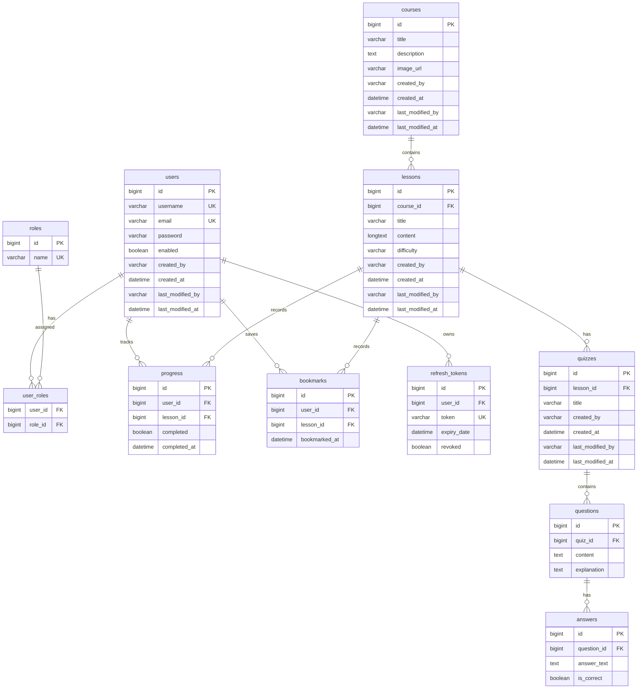

# Implementation Plan - Java Mastery Learning Platform

Xây dựng nền tảng học tập trực tuyến toàn diện về Java, cấu trúc dữ liệu và giải thuật (Java Mastery Learning Platform) dựa trên các yêu cầu nghiệp vụ và kỹ thuật đã đề ra.

## User Review Required

> [!IMPORTANT]
> **Khởi tạo dữ liệu học tập & Thư viện câu hỏi (Quiz Seeder):** 
> Hệ thống yêu cầu một thư viện lớn gồm hàng nghìn câu hỏi trắc nghiệm. Chúng tôi đề xuất xây dựng một cơ chế tự động nạp dữ liệu (`QuizSeeder` trong Spring Boot). Cơ chế này sẽ đọc dữ liệu từ các file cấu trúc (ví dụ: JSON) chứa hàng nghìn câu hỏi thuộc nhiều chủ đề (Java Core, OOP, Collections, DS&A) và tự động insert vào database khi ứng dụng khởi chạy lần đầu hoặc kích hoạt bởi Admin qua Dashboard. Phương án này linh hoạt hơn và tránh làm phình các file migration SQL của Flyway.
> 
> **Tài liệu học tập mẫu:** Chúng tôi sẽ chuẩn bị sẵn nội dung chi tiết dưới dạng Markdown cho các bài học tiêu biểu (như "Java Variables", "OOP Polymorphism", "Binary Search Tree") cùng bộ câu hỏi trắc nghiệm tương ứng để demo trực quan ngay khi hệ thống khởi chạy.

> [!IMPORTANT]
> **Phiên bản React & Thư viện UI:** Yêu cầu sử dụng React 19. Do một số thư viện như `lucide-react` hay cấu hình cũ của Shadcn UI có thể cảnh báo peer dependency với React 19, chúng tôi sẽ cấu hình cài đặt bằng flag `--legacy-peer-deps` để đảm bảo cài đặt suôn sẻ.

> [!IMPORTANT]
> **Bảo mật Refresh Token:** Để tăng cường bảo mật tránh tấn công XSS, chúng tôi đề xuất lưu trữ Refresh Token trong **HttpOnly Cookie** thay vì lưu ở LocalStorage, trong khi Access Token sẽ được trả về trong JSON body của response login.

## Resolved Decisions

- **Không phát triển Online Compiler:** Tập trung hoàn toàn vào lý thuyết và câu hỏi trắc nghiệm (Single/Multiple Choice) để tối ưu hóa trải nghiệm cốt lõi theo đúng yêu cầu.
- **Cỡ phân trang mặc định (Pagination):** Thiết lập cỡ trang mặc định là **10 bài học/trang** (và 10 mục/trang cho các danh sách khác).
- **Cấu trúc thư mục:** Di chuyển mã nguồn Spring Boot hiện tại từ `java-learning-platform/java-learning-platform` sang thư mục `backend/` của dự án để đảm bảo phân tách rõ ràng và cấu hình Docker Compose chuẩn xác.

---

## Proposed Changes

Dự án được cấu trúc thành 2 phần chính: **backend** (Spring Boot 3) và **frontend** (React + Vite + Tailwind CSS).

```
d:/Java web project/
├── backend/                  # Source code Spring Boot 3
├── frontend/                 # Source code React (Vite)
├── docker-compose.yml        # Docker compose để chạy toàn bộ hệ thống
└── implementation_plan.md    # File kế hoạch lập trình này
```

---

### 1. Database Schema Design (MySQL)

Chúng ta sẽ tạo các bảng với các trường Audit (`created_by`, `created_at`, `last_modified_by`, `last_modified_at`) và các mối quan hệ khoá ngoại.



---

### 2. Backend Component (`backend`)

Sử dụng **Spring Boot 3.5.x**, **Java 17/21**, **Spring Security**, **Spring Data JPA**, **MySQL Driver**, **Flyway** (để quản lý migration), và **MapStruct** (để map DTO).

#### Các Thư mục & File Cần Tạo:

- `src/main/java/com/javamastery//`
  - `config/`: Cấu hình Spring Security, CORS, Audit, OpenAPI Swagger, WebMvc.
  - `security/`: JWT Provider, Filter, UserDetails, Custom Authentication Entry Point.
  - `entity/`: Các Class Entity đại diện cho các bảng (User, Role, Course, Lesson, Quiz, Question, Answer, Progress, Bookmark, RefreshToken).
  - `repository/`: Các Interface JpaRepository tương ứng.
  - `dto/`: Lớp chứa dữ liệu truyền tải (Request/Response DTOs cho Auth, User, Course, Lesson, Quiz, Progress, Analytics).
  - `mapper/`: Các Interface MapStruct để ánh xạ Entity <-> DTO.
  - `service/`: Interface chứa logic nghiệp vụ và Class triển khai (`Impl`).
  - `controller/`: Các RestController cung cấp API endpoint.
  - `exception/`: GlobalExceptionHandler và các Exception tự định nghĩa (`ResourceNotFoundException`, `BadRequestException`, v.v.).
- `src/main/resources/`
  - `db/migration/`: Chứa các file SQL của Flyway (`V1__init_schema.sql`, `V2__seed_data.sql`).
  - `application.yml`: Cấu hình kết nối DB, JWT, Port, Logging.

#### [NEW] [pom.xml](file:///d:/Java%20web%20project/backend/pom.xml)
Khai báo các dependency cần thiết (Spring Web, Security, JPA, Validation, Lombok, MapStruct, OpenAPI Swagger, Flyway, MySQL).

#### [NEW] [application.yml](file:///d:/Java%20web%20project/backend/src/main/resources/application.yml)
Cấu hình Spring Boot, cổng chạy (8080), kết nối MySQL, cấu hình JWT secret và thời gian hết hạn (Access Token: 15 phút, Refresh Token: 7 ngày).

#### [NEW] [V1__init_schema.sql](file:///d:/Java%20web%20project/backend/src/main/resources/db/migration/V1__init_schema.sql)
Tạo cấu trúc bảng đầy đủ như thiết kế ERD.

#### [NEW] [SecurityConfig.java](file:///d:/Java%20web%20project/backend/src/main/java/com/javamastery/config/SecurityConfig.java)
Cấu hình phân quyền API:
- `/api/auth/**` -> permitAll
- `/api/courses/**` -> permitAll (chỉ xem bài học preview)
- Các API admin `/api/admin/**` -> có quyền `ROLE_ADMIN`
- Các API cá nhân sinh viên -> phải authenticated (`ROLE_USER` hoặc `ROLE_ADMIN`).

---

### 3. Frontend Component (`frontend`)

Sử dụng **React 19**, **Vite** làm build tool, **Tailwind CSS** để thiết kế giao diện, **Shadcn UI** làm component library, và **Axios** để giao tiếp API.

#### Giao diện chính & Component cần xây dựng:
- **Layouts**: Layout cho khách (Public Layout), Layout cho học viên có Sidebar (Dashboard Layout), Layout cho Admin Dashboard.
- **Pages**:
  - `Home`: Giới thiệu nền tảng, lộ trình học tập, danh sách các chủ đề chính (Java Basics, OOP, DS&A).
  - `Login` & `Register`: Xác thực người dùng, xử lý lưu Access Token trong bộ nhớ / Cookie.
  - `Courses`: Danh sách các khoá học/chủ đề lớn kèm tiến độ tổng quan.
  - `Lessons`: Trang đọc nội dung bài học (hiển thị Markdown rõ ràng, highlight cú pháp code Java), nút đánh dấu "Hoàn thành bài học" (để tính tiến trình) và nút "Bookmark".
  - `Quiz`: Giao diện làm bài trắc nghiệm tương tác cao. Chọn đáp án -> Nộp bài -> Hiển thị kết quả điểm số (đạt >= 70% mới hoàn thành), đáp án đúng/sai kèm giải thích cặn kẽ cho từng câu.
  - `Dashboard` (Student): Thống kê tiến độ học tập cá nhân, danh sách bài học đã bookmark, lịch sử làm quiz.
  - `Admin Dashboard`:
    - Quản lý người dùng: Danh sách tài khoản, nút khóa (Block)/mở khóa (Unblock).
    - Quản lý bài học & khóa học: Thêm/Sửa/Xóa khóa học và bài học (tích hợp trình soạn thảo Markdown).
    - Quản lý câu hỏi & Quiz: Giao diện thêm câu hỏi trắc nghiệm và câu trả lời.
    - Analytics: Biểu đồ thống kê lượng người dùng mới, tỷ lệ hoàn thành bài học, bài học phổ biến.

#### Các Thư mục & File Cần Tạo:

- `src/`
  - `components/`: UI components dùng chung (Button, Card, Input, Dialog, Toast, ThemeProvider cho Dark/Light Mode).
  - `layouts/`: `PublicLayout.jsx`, `DashboardLayout.jsx`, `AdminLayout.jsx`.
  - `pages/`: Thư mục con cho từng trang (`Home`, `Login`, `Register`, `Lessons`, `Quiz`, `StudentDashboard`, `AdminDashboard`, v.v.).
  - `services/`: Axios instance cấu hình tự động đính kèm JWT Token và xử lý Refresh Token hết hạn qua Interceptor.
  - `context/`: `AuthContext.jsx` quản lý trạng thái đăng nhập toàn cục.
  - `index.css`: Cấu hình Tailwind và biến màu sắc CSS Variable phục vụ Dark Mode (Primary `#2563EB`, Secondary `#14B8A6`, Font `Inter`).
  - `App.jsx` & `main.jsx`: Định tuyến React Router và khởi tạo ứng dụng.

---

### 4. Docker & Deployment (`docker`)

Cung cấp giải pháp chạy thử và deploy ứng dụng chỉ bằng một câu lệnh thông qua Docker Compose.

#### [NEW] [Dockerfile](file:///d:/Java%20web%20project/backend/Dockerfile)
Dockerfile đa giai đoạn (Multi-stage build):
1. Build code Java bằng Maven/Gradle.
2. Run JAR file với JRE slim gọn nhẹ.

#### [NEW] [Dockerfile](file:///d:/Java%20web%20project/frontend/Dockerfile)
Dockerfile đa giai đoạn cho Frontend:
1. Build static files bằng Node.js.
2. Serve tĩnh bằng Nginx, cấu hình chuyển tiếp SPA (Single Page Application routing).

#### [NEW] [docker-compose.yml](file:///d:/Java%20web%20project/docker-compose.yml)
Chạy đồng thời:
1. Container `mysql` (Database).
2. Container `backend` (Spring Boot API).
3. Container `frontend` (React + Nginx phục vụ UI và Proxy API requests đến Backend).

---

## Verification Plan

### Automated Tests

#### Backend (JUnit 5 & Mockito)
- **Unit Tests**:
  - Kiểm thử `AuthService` (đăng ký trùng email, đăng nhập sai mật khẩu).
  - Kiểm thử `LessonService` và `QuizService` (tính điểm quiz đạt/không đạt).
- **Integration Tests**:
  - Gửi request đến `AuthController` kiểm tra việc cấp phát và làm mới JWT.
  - Kiểm tra phân quyền truy cập các API admin.
- *Command chạy:*
  ```bash
  cd backend
  mvn test
  ```

#### Frontend (Vitest & React Testing Library)
- Kiểm thử các component giao diện quan trọng như `QuizCard`, `ProgressBar`.
- Kiểm thử trạng thái đăng nhập/đăng xuất trong `AuthContext`.
- *Command chạy:*
  ```bash
  cd frontend
  npm run test
  ```

### Manual Verification

1. **Kiểm thử Luồng Sinh Viên**:
   - Truy cập trang chủ dưới vai trò khách -> Đọc bài viết mẫu -> Không làm được Quiz.
   - Đăng ký tài khoản mới -> Đăng nhập thành công -> Giao diện chuyển đổi trạng thái đã đăng nhập.
   - Vào bài học bất kỳ -> Nhấp "Bookmark" -> Kiểm tra trong Dashboard xem bài học đã lưu chưa.
   - Nhấp "Làm bài trắc nghiệm" -> Chọn đáp án đúng/sai -> Nộp bài -> Xem hiển thị điểm số và phần giải thích. Đạt trên 70% thì bài học chuyển trạng thái "Đã hoàn thành" trên thanh tiến trình.
2. **Kiểm thử Luồng Admin**:
   - Đăng nhập bằng tài khoản admin -> Truy cập trang `/admin`.
   - Tạo một khoá học mới và thêm bài học mới bằng Markdown -> Kiểm tra phía Student xem bài học hiển thị đúng định dạng không.
   - Thực hiện chức năng chặn (Block) một tài khoản Student -> Dùng tài khoản đó đăng nhập lại xem có bị từ chối truy cập không.
3. **Kiểm thử Responsive & Dark/Light Mode**:
   - Sử dụng Developer Tools chuyển sang chế độ Mobile (iPhone, iPad) để xác nhận Sidebar thu gọn thành Hamburger Menu, các Grid Card tự động xếp dọc.
   - Chuyển đổi giữa chế độ sáng và tối để kiểm tra màu sắc tương phản, tính thẩm mỹ cao.

---

## Bổ Sung Yêu Cầu Mới (Đợt 1 & 2)

Các yêu cầu bổ sung dưới đây sẽ được triển khai trên nền tảng kiến trúc ban đầu ở trên.

### Phân Tích Vấn Đề Hiện Tại & Giải Pháp

#### BUG-01: Đăng ký tài khoản không lưu vào Database

**Nguyên nhân gốc rễ:** Trong [AuthService.java](file:///d:/Java%20web%20project/backend/src/main/java/com/javamastery/service/AuthService.java), phương thức `register()` được đánh dấu `@Transactional`. Sau khi gọi `userRepository.save(user)`, nó lập tức gọi `authenticationManager.authenticate()` trong cùng giao dịch. Vì giao dịch chưa commit, bản ghi user chưa tồn tại trong DB → `CustomUserDetailsService.loadUserByUsername()` không tìm thấy user → ném `UsernameNotFoundException` → toàn bộ giao dịch bị rollback → user không được lưu.

**Giải pháp:**
- Loại bỏ việc gọi `authenticationManager.authenticate()` trong `register()`.
- Sử dụng trực tiếp `jwtProvider.generateTokenFromUsername(savedUser.getUsername())` để tạo JWT token từ entity đã lưu.
- Tạo `RefreshToken` trực tiếp từ `savedUser.getId()`.

#### BUG-02: Biểu đồ "Đăng ký theo thời gian" không hiện dữ liệu

**Nguyên nhân gốc rễ:** Trong [AdminService.java](file:///d:/Java%20web%20project/backend/src/main/java/com/javamastery/service/AdminService.java), phương thức `getAnalytics()` không tính toán và gán dữ liệu `userRegistrationsOverTime` vào `AnalyticsResponse` (trường này luôn trả về `null`).

**Giải pháp:**
- Thêm query `findAllCreatedAtDates()` vào `UserRepository`.
- Trong `getAnalytics()`, nhóm danh sách `createdAt` theo ngày (`yyyy-MM-dd`) và đếm số lượng để tạo `Map<String, Long>`.

---

### Thay Đổi Về Hệ Thống Vai Trò (Role)

#### Loại bỏ `ROLE_USER`, bổ sung vai trò chi tiết

Trong file [V1__init_schema.sql](file:///d:/Java%20web%20project/backend/src/main/resources/db/migration/V1__init_schema.sql), dòng 108 hiện seed `ROLE_USER`. Vai trò này quá chung chung và sẽ được thay thế bằng các vai trò chức năng cụ thể:

| Vai trò | Mô tả | Quyền hạn |
|---------|--------|-----------|
| `ROLE_STUDENT` | Học viên | Đọc bài, làm quiz, bookmark, xem tiến trình |
| `ROLE_INSTRUCTOR` | Giảng viên | Thêm/sửa/xóa bài học (Lesson) cho các khóa học Admin đã tạo |
| `ROLE_MANAGER` | Người quản lý | Theo dõi học viên không hoạt động > 15 ngày, gửi email nhắc nhở |
| `ROLE_ADMIN` | Quản trị viên | Toàn quyền (đã có sẵn) |

#### [NEW] [V5__update_roles_and_add_last_active.sql](file:///d:/Java%20web%20project/backend/src/main/resources/db/migration/V5__update_roles_and_add_last_active.sql)
- Xóa `ROLE_USER` khỏi bảng `roles` (và các liên kết `user_roles` tương ứng).
- Thêm `ROLE_INSTRUCTOR` và `ROLE_MANAGER` vào bảng `roles`.
- Thêm cột `last_active_at DATETIME` vào bảng `users` để theo dõi thời gian hoạt động cuối cùng.
- Seed tài khoản demo:
  - `instructor` / `student123` → `ROLE_INSTRUCTOR`
  - `manager` / `student123` → `ROLE_MANAGER`
- Cập nhật tài khoản `student` mặc định: `last_active_at = NOW() - INTERVAL 20 DAY` (để test nhắc nhở).

---

### Thay Đổi Backend

#### [MODIFY] [application.yml](file:///d:/Java%20web%20project/backend/src/main/resources/application.yml)
- Thêm cấu hình Jackson serialize `LocalDateTime` thành ISO-8601 string (không phải mảng số):
  ```yaml
  spring:
    jackson:
      serialization:
        write-dates-as-timestamps: false
  ```

#### [MODIFY] [User.java](file:///d:/Java%20web%20project/backend/src/main/java/com/javamastery/entity/User.java)
- Thêm trường `private LocalDateTime lastActiveAt;` với annotation `@Column(name = "last_active_at")`.

#### [MODIFY] [UserRepository.java](file:///d:/Java%20web%20project/backend/src/main/java/com/javamastery/repository/UserRepository.java)
- Thêm: `Page<User> findByEnabled(boolean enabled, Pageable pageable);`
- Thêm: `@Query("SELECT u FROM User u JOIN u.roles r WHERE r.name = 'ROLE_STUDENT' AND (u.lastActiveAt IS NULL OR u.lastActiveAt < :cutoffDate)") List<User> findInactiveStudents(@Param("cutoffDate") LocalDateTime cutoffDate);`
- Thêm: `@Query("SELECT u.createdAt FROM User u") List<LocalDateTime> findAllCreatedAtDates();`

#### [MODIFY] [AuthService.java](file:///d:/Java%20web%20project/backend/src/main/java/com/javamastery/service/AuthService.java)
- **`register()`**: Xóa block gọi `authenticationManager.authenticate()`. Dùng `jwtProvider.generateTokenFromUsername()` trực tiếp.
- **`login()`**: Sau khi đăng nhập thành công, cập nhật `user.setLastActiveAt(LocalDateTime.now())` và `userRepository.save(user)`.

#### [MODIFY] [AdminService.java](file:///d:/Java%20web%20project/backend/src/main/java/com/javamastery/service/AdminService.java)
- Triển khai tính toán `userRegistrationsOverTime` trong `getAnalytics()`.
- Thêm phương thức `getAllUsers(Pageable, Boolean enabled)` hỗ trợ lọc theo trạng thái.

#### [MODIFY] [AdminController.java](file:///d:/Java%20web%20project/backend/src/main/java/com/javamastery/controller/AdminController.java)
- Cập nhật endpoint `GET /api/admin/users` thêm `@RequestParam(required = false) Boolean enabled` để lọc theo tab.

#### [MODIFY] [CourseService.java](file:///d:/Java%20web%20project/backend/src/main/java/com/javamastery/service/CourseService.java)
- Thêm validation trong `createCourse()` và `updateCourse()`: mô tả khóa học phải >= 200 từ, nếu không ném `BadRequestException`.

#### [NEW] [LessonAdminController.java](file:///d:/Java%20web%20project/backend/src/main/java/com/javamastery/controller/LessonAdminController.java)
- `POST /api/admin/courses/{courseId}/lessons` — Tạo bài học mới.
- `PUT /api/admin/lessons/{lessonId}` — Cập nhật bài học.
- `DELETE /api/admin/lessons/{lessonId}` — Xóa bài học.
- Phân quyền: `@PreAuthorize("hasAnyRole('ADMIN', 'INSTRUCTOR')")`

#### [NEW] [LessonAdminService.java](file:///d:/Java%20web%20project/backend/src/main/java/com/javamastery/service/LessonAdminService.java)
- Logic CRUD cho bài học phục vụ `LessonAdminController`.

#### [NEW] [ManagerController.java](file:///d:/Java%20web%20project/backend/src/main/java/com/javamastery/controller/ManagerController.java)
- `GET /api/manager/inactive-students` — Lấy danh sách học viên không hoạt động > 15 ngày.
- `POST /api/manager/inactive-students/{studentId}/remind` — Gửi email nhắc nhở thủ công.
- Phân quyền: `@PreAuthorize("hasAnyRole('ADMIN', 'MANAGER')")`

#### [NEW] [ManagerService.java](file:///d:/Java%20web%20project/backend/src/main/java/com/javamastery/service/ManagerService.java)
- Logic nghiệp vụ phục vụ `ManagerController`.

#### [NEW] [EmailService.java](file:///d:/Java%20web%20project/backend/src/main/java/com/javamastery/service/EmailService.java)
- Dịch vụ gửi email giả lập (Mock), in nội dung email ra log console để dễ kiểm thử mà không cần SMTP.

#### [NEW] [InactiveStudentScheduler.java](file:///d:/Java%20web%20project/backend/src/main/java/com/javamastery/scheduler/InactiveStudentScheduler.java)
- Cron Job chạy hàng ngày (`@Scheduled(cron = "0 0 1 * * ?")`).
- Quét học viên không hoạt động > 15 ngày → gửi email nhắc nhở qua `EmailService`.

#### [NEW] [LastActiveFilter.java](file:///d:/Java%20web%20project/backend/src/main/java/com/javamastery/security/LastActiveFilter.java)
- Cập nhật `lastActiveAt` của user mỗi khi gọi API hợp lệ (giới hạn tần suất tối đa 1 lần/giờ).

---

### Thay Đổi Frontend

#### [MODIFY] [index.html](file:///d:/Java%20web%20project/frontend/index.html)
- Đổi `<title>frontend</title>` → `<title>JavaMastery - Nền Tảng Học Lập Trình Java Trực Tuyến</title>`.
- Nhúng thư viện Highcharts qua CDN: `<script src="https://code.highcharts.com/highcharts.js"></script>`.

#### [MODIFY] [AdminLayout.jsx](file:///d:/Java%20web%20project/frontend/src/layouts/AdminLayout.jsx)
- **Xóa** phần hiển thị email và role ở Desktop Header (dòng 198-203).
- **Xóa** nút "Giao diện học viên" thừa trong sidebar footer (dòng 151-153).
- Bổ sung listener `window.addEventListener('theme-change', ...)` để cập nhật theme khi thay đổi từ trang Cài đặt.

#### [MODIFY] [DashboardLayout.jsx](file:///d:/Java%20web%20project/frontend/src/layouts/DashboardLayout.jsx)
- **Xóa** phần hiển thị email ở Desktop Header (dòng 197-201).
- Bổ sung listener `window.addEventListener('theme-change', ...)` tương tự.

#### [MODIFY] [AdminDashboard.jsx](file:///d:/Java%20web%20project/frontend/src/pages/AdminDashboard.jsx)
- Thay thế biểu đồ SVG tự vẽ bằng **Highcharts column chart** (sử dụng `window.Highcharts` từ CDN).
- Cấu hình Highcharts theo mẫu:
  ```js
  Highcharts.chart('registration-chart-container', {
    chart: { type: 'column' },
    title: { text: 'Đăng Ký Theo Thời Gian' },
    xAxis: { categories: [...dates] },
    yAxis: { title: { text: 'Số lượng' } },
    series: [{ name: 'Người dùng mới', data: [...counts] }],
    responsive: { rules: [{ condition: { maxWidth: 500 }, ... }] }
  });
  ```

#### [MODIFY] [AdminCourses.jsx](file:///d:/Java%20web%20project/frontend/src/pages/AdminCourses.jsx)
- **Bộ đếm từ cho mô tả (>= 200 từ):** Hiển thị `"X/200 từ"` dưới textarea, màu đỏ khi < 200, màu xanh khi >= 200. Chặn submit nếu chưa đủ.
- **Xem trước hình ảnh (Image Preview):** Khung preview tỉ lệ 16:9, bo góc mềm mại ngay dưới ô nhập URL ảnh khóa học (phong cách F8). Hiển thị ảnh thực tế hoặc placeholder mặc định.
- **Quản lý bài học:** Thêm nút "Thêm bài học", nút Sửa/Xóa bài học trong danh sách mở rộng. Modal form thêm/sửa bài học (tiêu đề, độ khó, nội dung Markdown). Phân quyền cho `ROLE_ADMIN` và `ROLE_INSTRUCTOR`.

#### [MODIFY] [Courses.jsx](file:///d:/Java%20web%20project/frontend/src/pages/Courses.jsx)
- Hiển thị ảnh đại diện khóa học (`course.imageUrl`) ở header card.
- Nếu có ảnh: dùng `background-image` + overlay tối `rgba(0,0,0,0.4)` để text hiển thị rõ nét.
- Nếu không có ảnh: giữ gradient màu như hiện tại.

#### [MODIFY] [AdminUsers.jsx](file:///d:/Java%20web%20project/frontend/src/pages/AdminUsers.jsx)
- Thêm thanh Tab gồm 3 tab: **"Tất cả"**, **"Đang hoạt động"**, **"Đã khóa"**.
- Mỗi tab gửi request với param `enabled` tương ứng (`null`, `true`, `false`) để lọc phân trang từ backend.

#### [MODIFY] [Profile.jsx](file:///d:/Java%20web%20project/frontend/src/pages/Profile.jsx)
- Thiết kế lại thành 3 tab:
  1. **"Thông tin cá nhân"** — Form cập nhật tên và email.
  2. **"Bảo mật"** — Form đổi mật khẩu.
  3. **"Cài đặt hệ thống"** — Chứa switch chuyển đổi giao diện sáng/tối dạng dọc.
- **Switch Sáng/Tối dạng dọc (Vertical Toggle Switch):**
  - Kích thước: 50px rộng × 90px cao, bo tròn góc hoàn toàn.
  - Thanh trượt tròn chạy lên/xuống mượt mà (CSS transition).
  - Phía trên: icon Mặt trời (☀). Phía dưới: icon Mặt trăng (🌙).
  - Chế độ Sáng: nền trắng, Sun = xanh lá, Moon = xám.
  - Chế độ Tối: nền đen, Sun = xám, Moon = xanh lá.
  - Click → thay đổi theme toàn cục, dispatch `window.dispatchEvent(new Event('theme-change'))`.

#### [NEW] [ManagerStudents.jsx](file:///d:/Java%20web%20project/frontend/src/pages/ManagerStudents.jsx)
- Trang quản lý dành cho Manager.
- Hiển thị danh sách học viên không hoạt động > 15 ngày: Tên, Email, Ngày hoạt động cuối, Số ngày không hoạt động.
- Nút "Gửi email nhắc nhở" cho từng học viên.

---

### Verification Plan Bổ Sung

#### Kiểm thử đăng ký
- Đăng ký tài khoản mới → kiểm tra tài khoản được lưu thành công vào DB MySQL → tự động đăng nhập vào Dashboard.

#### Kiểm thử vai trò ROLE_INSTRUCTOR
- Đăng nhập `instructor` → truy cập trang Quản lý Khóa học → thêm/sửa/xóa bài học → xác nhận bài học hiển thị đúng ở phía học viên.
- Xác nhận giảng viên không có quyền tạo/xóa khóa học.

#### Kiểm thử vai trò ROLE_MANAGER
- Đăng nhập `manager` → truy cập trang quản lý học viên lười học → xác nhận danh sách hiển thị `student` (20 ngày không hoạt động) → bấm gửi email → kiểm tra log console Spring Boot.

#### Kiểm thử biểu đồ Highcharts
- Truy cập `/admin` → biểu đồ cột Highcharts hiển thị lượng đăng ký mới theo ngày.

#### Kiểm thử Tab trạng thái người dùng
- Truy cập Quản lý Người dùng → chuyển giữa các tab "Tất cả" / "Đang hoạt động" / "Đã khóa" → danh sách lọc chính xác.

#### Kiểm thử 200 từ & Xem trước ảnh
- Tạo khóa học với mô tả < 200 từ → form báo lỗi, không gửi.
- Nhập URL ảnh → khung preview hiển thị ảnh tức thì.

#### Kiểm thử Switch giao diện & Tên trang web
- Truy cập Hồ sơ → Tab Cài đặt → click switch dọc → giao diện sáng/tối chuyển đổi tức thì.
- Kiểm tra tab trình duyệt hiển thị "JavaMastery - Nền Tảng Học Lập Trình Java Trực Tuyến".

#### Kiểm thử hình ảnh khóa học
- Truy cập trang Khóa học phía học viên → khóa học có `imageUrl` hiển thị ảnh đại diện trên card.

---

## Bổ Sung Yêu Cầu Mới (Đợt 3): Thay Đổi Ảnh Đại Diện Từ Máy Tính

### Phân Tích & Giải Giải Pháp

Hệ thống cần cung cấp tính năng cho phép người dùng thay đổi ảnh đại diện (avatar) của mình bằng cách tải tệp ảnh từ máy tính cá nhân lên thay vì chỉ dùng ảnh mặc định.

**Giải pháp đề xuất:**
1. **Lưu trữ tệp:** Lưu trữ ảnh trực tiếp trên ổ đĩa của server tại thư mục `uploads/avatars/` nằm trong thư mục chạy của backend. Để tránh trùng lặp tên tệp và khắc phục lỗi cache của trình duyệt khi cập nhật ảnh mới, tên tệp sẽ được đặt lại theo dạng `<userId>_<timestamp>.<extension>`.
2. **Cấu hình Spring Boot:**
   - Cấu hình kích thước tải tệp tối đa (tối đa 5MB) và kiểm tra kiểu tệp (MIME Type) ở cả client và server chỉ cho phép các định dạng ảnh phổ biến (`image/jpeg`, `image/png`, `image/gif`, `image/webp`).
   - Cấu hình `WebMvcConfigurer` để ánh xạ đường dẫn URL `/uploads/**` tới thư mục vật lý `uploads/` trên đĩa.
3. **Database:** Cột `avatar_url` (VARCHAR(500)) được thêm vào bảng `users` để lưu đường dẫn tương đối của ảnh đại diện (ví dụ: `/uploads/avatars/1_162391283912.png`). Ta sẽ cập nhật file SQL `V5__update_roles_and_add_last_active.sql` để bổ sung cột này hoặc tạo file di trú mới.
4. **API Endpoint:**
   - `POST /api/users/profile/avatar`: Nhận tệp hình ảnh qua `MultipartFile` và tiến hành lưu file, cập nhật thuộc tính `avatarUrl` trong thực thể `User`, và trả về thông tin `UserResponse` mới đã chứa đường dẫn ảnh đại diện.
5. **Frontend UI:**
   - Tại trang `Profile.jsx` (Tab "Thông tin cá nhân"), hiển thị ảnh đại diện hiện tại dưới dạng hình tròn.
   - Thêm nút hover có icon máy ảnh (Camera) đè lên ảnh đại diện.
   - Nhấp vào nút sẽ kích hoạt `<input type="file" accept="image/*" />` ẩn.
   - Khi chọn ảnh, client-side sẽ kiểm tra định dạng và dung lượng (< 5MB), hiển thị ảnh preview tức thời bằng `URL.createObjectURL(file)`, sau đó gửi `FormData` lên backend qua API `POST /api/users/profile/avatar`.
   - Cập nhật state `user` trong `AuthContext` để đồng bộ ảnh đại diện ở Header và Sidebar ngay lập tức mà không cần tải lại trang.

---

### Chi Tiết Thay Đổi

#### 1. Thay Đổi Cơ Sở Dữ Liệu
- Bổ sung lệnh SQL thêm cột `avatar_url` vào bảng `users` trong file di trú:
  ```sql
  ALTER TABLE users ADD COLUMN avatar_url VARCHAR(500) NULL;
  ```

#### 2. Thay Đổi Backend (`backend`)

##### [MODIFY] [application.yml](file:///d:/Java%20web%20project/backend/src/main/resources/application.yml)
- Cấu hình dung lượng file upload tối đa:
  ```yaml
  spring:
    servlet:
      multipart:
        max-file-size: 5MB
        max-request-size: 5MB
  ```

##### [MODIFY] [User.java](file:///d:/Java%20web%20project/backend/src/main/java/com/javamastery/entity/User.java)
- Thêm trường `private String avatarUrl;` cùng với ánh xạ cột `@Column(name = "avatar_url", length = 500)`.

##### [MODIFY] [UserResponse.java](file:///d:/Java%20web%20project/backend/src/main/java/com/javamastery/dto/UserResponse.java)
- Bổ sung trường dữ liệu phản hồi:
  ```java
  private String avatarUrl;
  ```

##### [MODIFY] [WebMvcConfig.java](file:///d:/Java%20web%20project/backend/src/main/java/com/javamastery/config/WebMvcConfig.java)
- Cấu hình ánh xạ thư mục tĩnh phục vụ file tải lên:
  ```java
  @Override
  public void addResourceHandlers(org.springframework.web.servlet.config.annotation.ResourceHandlerRegistry registry) {
      registry.addResourceHandler("/uploads/**")
              .addResourceLocations("file:uploads/");
  }
  ```

##### [MODIFY] [UserController.java](file:///d:/Java%20web%20project/backend/src/main/java/com/javamastery/controller/UserController.java)
- Tạo endpoint tải ảnh đại diện:
  ```java
  @PostMapping(value = "/profile/avatar", consumes = org.springframework.http.MediaType.MULTIPART_FORM_DATA_VALUE)
  public ResponseEntity<UserResponse> updateAvatar(
          @AuthenticationPrincipal UserPrincipal userPrincipal,
          @RequestParam("file") org.springframework.web.multipart.MultipartFile file) {
      UserResponse response = userService.updateUserAvatar(userPrincipal.getId(), file);
      return ResponseEntity.ok(response);
  }
  ```

##### [MODIFY] [UserService.java](file:///d:/Java%20web%20project/backend/src/main/java/com/javamastery/service/UserService.java)
- Triển khai logic lưu ảnh đại diện:
  ```java
  @org.springframework.transaction.annotation.Transactional
  public UserResponse updateUserAvatar(Long userId, org.springframework.web.multipart.MultipartFile file) {
      if (file.isEmpty()) {
          throw new BadRequestException("File is empty!");
      }
      
      // Validate file type
      String contentType = file.getContentType();
      if (contentType == null || (!contentType.equals("image/jpeg") && !contentType.equals("image/png") && 
          !contentType.equals("image/gif") && !contentType.equals("image/webp"))) {
          throw new BadRequestException("Only JPEG, PNG, GIF, and WEBP images are allowed!");
      }
 
      User user = userRepository.findById(userId)
              .orElseThrow(() -> new ResourceNotFoundException("User not found"));

      try {
          String originalFilename = file.getOriginalFilename();
          String extension = originalFilename != null && originalFilename.contains(".") 
                  ? originalFilename.substring(originalFilename.lastIndexOf(".")) 
                  : ".png";
          
          String filename = userId + "_" + System.currentTimeMillis() + extension;
          java.nio.file.Path uploadPath = java.nio.file.Paths.get("uploads/avatars");
          
          if (!java.nio.file.Files.exists(uploadPath)) {
              java.nio.file.Files.createDirectories(uploadPath);
          }
          
          // Delete old avatar file if exists
          if (user.getAvatarUrl() != null && user.getAvatarUrl().startsWith("/uploads/avatars/")) {
              String oldFilename = user.getAvatarUrl().substring(user.getAvatarUrl().lastIndexOf("/") + 1);
              java.nio.file.Path oldFilePath = uploadPath.resolve(oldFilename);
              java.nio.file.Files.deleteIfExists(oldFilePath);
          }
          
          java.nio.file.Path filePath = uploadPath.resolve(filename);
          java.nio.file.Files.copy(file.getInputStream(), filePath, java.nio.file.StandardCopyOption.REPLACE_EXISTING);
          
          user.setAvatarUrl("/uploads/avatars/" + filename);
          User updatedUser = userRepository.save(user);
          return userMapper.toResponse(updatedUser);
      } catch (java.io.IOException e) {
          throw new RuntimeException("Failed to store file: " + e.getMessage());
      }
  }
  ```

#### 3. Thay Đổi Frontend (`frontend`)

##### [MODIFY] [Profile.jsx](file:///d:/Java%20web%20project/frontend/src/pages/Profile.jsx)
- Trong form "Thông tin cá nhân", đặt một khu vực hiển thị ảnh tròn với nút thay đổi:
  - Khi hover vào ảnh đại diện, hiển thị một overlay mờ và icon Camera.
  - Sử dụng `<input type="file" ref={fileInputRef} className="hidden" accept="image/*" onChange={handleFileChange} />`.
  - Hàm `handleFileChange` thực hiện validate tệp (kích thước < 5MB) và gọi API:
    ```js
    const handleFileChange = async (e) => {
      const file = e.target.files[0];
      if (!file) return;
      
      // Client-side validation
      if (file.size > 5 * 1024 * 1024) {
        toast.error("Kích thước tệp không được vượt quá 5MB!");
        return;
      }
      
      const formData = new FormData();
      formData.append("file", file);
      
      try {
        setUploading(true);
        const response = await api.post("/users/profile/avatar", formData, {
          headers: { "Content-Type": "multipart/form-data" }
        });
        updateUser(response.data); // Cập nhật state user trong AuthContext
        toast.success("Cập nhật ảnh đại diện thành công!");
      } catch (err) {
        toast.error(err.response?.data?.message || "Tải ảnh lên thất bại!");
      } finally {
        setUploading(false);
      }
    };
    ```

##### [MODIFY] [AuthContext.jsx](file:///d:/Java%20web%20project/frontend/src/context/AuthContext.jsx)
- Cập nhật hàm `updateUser` hoặc đảm bảo thông tin `user.avatarUrl` được cập nhật đồng bộ.
- Cung cấp hàm hoặc biến URL cơ sở của backend (ví dụ: `http://localhost:8080`) để tạo đường dẫn ảnh đầy đủ:
  ```js
  const getAvatarUrl = (avatarUrl) => {
    if (!avatarUrl) return "/default-avatar.png"; // hoặc ảnh placeholder chữ cái
    if (avatarUrl.startsWith("http")) return avatarUrl;
    return `${API_BASE_URL}${avatarUrl}`;
  };
  ```

##### [MODIFY] [AdminLayout.jsx](file:///d:/Java%20web%20project/frontend/src/layouts/AdminLayout.jsx) & [DashboardLayout.jsx](file:///d:/Java%20web%20project/frontend/src/layouts/DashboardLayout.jsx)
- Cập nhật thẻ `` hiển thị avatar trên Header/Sidebar bằng cách sử dụng hàm `getAvatarUrl(user.avatarUrl)`.

---

### Verification Plan Bổ Sung (Đợt 3)

#### Kiểm thử thủ công:
1. **Tải lên ảnh hợp lệ:**
   - Đăng nhập -> Vào Hồ sơ -> Tab Thông tin cá nhân.
   - Click nút đổi ảnh -> Chọn một ảnh `.png` hoặc `.jpg` từ máy tính.
   - Xác nhận ảnh đại diện thay đổi ngay lập tức trên UI và có Toast thông báo thành công.
   - Kiểm tra ảnh đại diện hiển thị trên Header và Sidebar xem có đồng bộ không.
   - F5 tải lại trang -> Xác nhận ảnh đại diện vẫn giữ nguyên ảnh mới tải lên.
2. **Kiểm thử tệp không hợp lệ:**
   - Click nút đổi ảnh -> Chọn một file `.pdf` hoặc `.txt`.
   - Xác nhận client báo lỗi không hỗ trợ và không gửi request lên backend.
3. **Kiểm thử tệp quá dung lượng:**
   - Chọn file ảnh dung lượng 6MB.
   - Xác nhận client báo lỗi vượt dung lượng cho phép.
4. **Kiểm thử xóa ảnh cũ:**
   - Thực hiện tải lên ảnh đại diện mới lần thứ 2.
   - Kiểm tra thư mục `backend/uploads/avatars/` xem tệp ảnh cũ đã được xóa bỏ để tiết kiệm bộ nhớ chưa.

---

## Bổ Sung Cải Tiến (Đề xuất thêm của AI)

Nhằm tối ưu hóa hơn nữa về tính bảo mật, hiệu năng và trải nghiệm người dùng (UX) cho trang web, chúng tôi đề xuất bổ sung thêm các điểm kỹ thuật sau vào kế hoạch:

### 1. Nâng cấp Bảo mật & Mạng (Security & Static Handling)
- **Cho phép truy cập Công khai Thư mục Uploads:** Cấu hình Security cho phép truy cập tự do tới đường dẫn `/uploads/**` mà không yêu cầu header Authorization.
- **Xóa Ảnh Cũ trên Đĩa khi Cập nhật:** Khi người dùng thay đổi ảnh đại diện mới, hệ thống tự động xóa tệp ảnh cũ khỏi máy chủ vật lý nhằm tránh lãng phí dung lượng lưu trữ.

### 2. Trải Nghiệm Người Dùng (UX) trên Trang Profile
- **Thanh Tiến Trình Upload (Upload Progress Bar):** Hiển thị loading spinner hoặc thanh tiến trình khi tệp ảnh đang được truyền tải lên máy chủ.
- **Nút Hiển Thị Mật Khẩu (Show/Hide Password):** Bổ sung nút bấm (icon Con mắt) trên biểu mẫu đổi mật khẩu để người dùng dễ dàng kiểm tra trước khi xác nhận.
- **Cảnh báo Khớp Mật Khẩu Trực Quan:** Hiển thị thông báo đỏ/xanh lá dạng thời gian thực khi mật khẩu nhập lại khớp/không khớp với mật khẩu mới.

### 3. Đồng bộ hóa Trạng thái Toàn cục (State Syncing)
- **Cập Nhật Avatar Đồng Bộ:** Đảm bảo khi thông tin hồ sơ được chỉnh sửa thành công, các thành phần giao diện khác như Header hay Sidebar cũng sẽ cập nhật ngay lập tức thông qua AuthContext mà không cần tải lại trang.

- **Cập Nhật Avatar Đồng Bộ:** Đảm bảo khi thông tin hồ sơ được chỉnh sửa thành công, các thành phần giao diện khác như Header hay Sidebar cũng sẽ cập nhật ngay lập tức thông qua AuthContext mà không cần tải lại trang.

---

## Bổ Sung Yêu Cầu Mới (Đợt 4): Sử dụng mật khẩu đơn giản (Plain Text) & Hoàn thiện Phân luồng Vai trò (Loại bỏ Manager, Instructor có đầy đủ quyền giảng dạy)

### 1. Phân Tích & Giải Pháp

#### Yêu cầu 1: Sử dụng mật khẩu đơn giản thay vì mã hóa hash
Để thuận tiện cho việc kiểm tra và hiển thị mật khẩu người dùng trong quá trình test/inspect cơ sở dữ liệu:
- **Thay đổi PasswordEncoder:** Trong [SecurityConfig.java](file:///d:/Java%20web%20project/backend/src/main/java/com/javamastery/config/SecurityConfig.java), chuyển đổi bean `PasswordEncoder` từ `BCryptPasswordEncoder` sang `NoOpPasswordEncoder.getInstance()`. Lưu và so sánh mật khẩu dạng chuỗi thô.
- **Cập nhật dữ liệu Seed:**
  - Thay đổi các chuỗi BCrypt hash trong các file migration SQL ([V2__seed_roles_and_admin.sql](file:///d:/Java%20web%20project/backend/src/main/resources/db/migration/V2__seed_roles_and_admin.sql) và [V5__update_roles_and_add_last_active.sql](file:///d:/Java%20web%20project/backend/src/main/resources/db/migration/V5__update_roles_and_add_last_active.sql)) thành mật khẩu đơn giản tương ứng.
  - Đổi `admin` thành `'admin123'`.
  - Đổi `student` thành `'student123'`.
  - Đổi `instructor` thành `'instructor123'` (có mật khẩu riêng như yêu cầu).
- **Lưu ý:** Reset database bằng `docker compose down -v` và chạy lại hoặc `mvn flyway:clean flyway:migrate` để cập nhật Flyway checksum.

#### Yêu cầu 2: Loại bỏ vai trò Manager và chuyển chức năng sang Admin
- Do "manager là admin luôn nên bỏ manager", ta xóa bỏ hoàn toàn `ROLE_MANAGER` và tài khoản `manager` trong hệ thống.
- Chuyển các chức năng theo dõi học viên không hoạt động và gửi email nhắc nhở từ [ManagerController.java](file:///d:/Java%20web%20project/backend/src/main/java/com/javamastery/controller/ManagerController.java) sang [AdminController.java](file:///d:/Java%20web%20project/backend/src/main/java/com/javamastery/controller/AdminController.java) dưới route `/api/admin/inactive-students` và `/api/admin/inactive-students/{studentId}/remind`.
- Xóa bỏ layout `/manager` và chuyển tab "Học viên không hoạt động" vào trang [AdminUsers.jsx](file:///d:/Java%20web%20project/frontend/src/pages/AdminUsers.jsx) để Admin quản lý tập trung.

#### Yêu cầu 3: Hoàn thiện vai trò Instructor (`ROLE_INSTRUCTOR`) giảng dạy
Instructor có các quyền và chức năng tương đương một giáo viên:
- **Tạo, sửa, xóa khóa học và bài học:** Cho phép `ROLE_INSTRUCTOR` gọi các API của `CourseController` và `LessonAdminController` (phân quyền `@PreAuthorize("hasAnyRole('ADMIN', 'INSTRUCTOR')")`).
- **Upload video/tài liệu bài học:**
  - Bổ sung API tải tài liệu bài học: `POST /api/admin/lessons/upload` lưu trữ tệp vào thư mục `uploads/materials/`.
  - Trên giao diện Modal bài học ([AdminCourses.jsx](file:///d:/Java%20web%20project/frontend/src/pages/AdminCourses.jsx)), thêm trường tải lên file video/tài liệu bài học, hiển thị URL và cho phép chèn link vào Markdown bài học.
- **Tạo quiz/bài tập:**
  - Viết các API CRUD cho Quiz và Câu hỏi/Đáp án trong `QuizAdminController.java`.
  - Trên giao diện mở rộng của khóa học ([AdminCourses.jsx](file:///d:/Java%20web%20project/frontend/src/pages/AdminCourses.jsx)), tích hợp nút "+ Tạo Quiz" / "Sửa Quiz" / "Xóa Quiz" bên cạnh mỗi bài học. Khi bấm vào, mở Modal trình tạo Quiz cho phép thêm/sửa/xóa câu hỏi trắc nghiệm (nhập nội dung câu hỏi, mô tả giải thích, danh sách đáp án, tích chọn đáp án đúng).
- **Chấm điểm & Theo dõi tiến độ học viên:**
  - Viết API `GET /api/admin/students/progress` trong `AdminController.java` trả về danh sách học viên, số bài đã học, điểm quiz trung bình và lịch sử làm quiz chi tiết.
  - Tạo trang giao diện mới `AdminGrades.jsx` ("Tiến độ & Điểm số") hiển thị danh sách học viên và cho phép xem chi tiết bảng điểm lịch sử làm bài ("Chấm điểm" tự động từ hệ thống).
- **Hỏi đáp / Discussion trong bài học:**
  - Thiết kế bảng cơ sở dữ liệu `discussions` (lưu thảo luận của từng bài học và phản hồi của giảng viên/admin).
  - Viết API `GET /api/lessons/{lessonId}/discussions` và `POST /api/lessons/{lessonId}/discussions` (đăng bài thảo luận/trả lời).
  - Giao diện Student ([LessonDetail.jsx](file:///d:/Java%20web%20project/frontend/src/pages/LessonDetail.jsx)): Thêm khu vực "Hỏi đáp & Thảo luận" ở cuối bài học.
  - Giao diện Admin/Instructor: Thêm trang `AdminDiscussions.jsx` hiển thị danh sách câu hỏi thảo luận mới nhất trên toàn hệ thống và cho phép giảng viên/admin nhấp trả lời trực tiếp.

### 2. Chi Tiết Thay Đổi

#### Thay Đổi Cơ Sở Dữ Liệu
- Cập nhật [V5__update_roles_and_add_last_active.sql](file:///d:/Java%20web%20project/backend/src/main/resources/db/migration/V5__update_roles_and_add_last_active.sql) để loại bỏ `ROLE_MANAGER` và user `manager`. Cấu hình mật khẩu đơn giản cho `instructor`.
- [NEW] [V6__create_discussions_schema.sql](file:///d:/Java%20web%20project/backend/src/main/resources/db/migration/V6__create_discussions_schema.sql) để khởi tạo bảng `discussions` chứa dữ liệu thảo luận/hỏi đáp.

#### Thay Đổi Backend (`backend`)

##### [MODIFY] [SecurityConfig.java](file:///d:/Java%20web%20project/backend/src/main/java/com/javamastery/config/SecurityConfig.java)
- Thay đổi `BCryptPasswordEncoder` thành `NoOpPasswordEncoder.getInstance()`.

##### [DELETE] [ManagerController.java](file:///d:/Java%20web%20project/backend/src/main/java/com/javamastery/controller/ManagerController.java) & [ManagerService.java](file:///d:/Java%20web%20project/backend/src/main/java/com/javamastery/service/ManagerService.java)
- Xóa bỏ các file controller và service dành riêng cho Manager.

##### [MODIFY] [CourseController.java](file:///d:/Java%20web%20project/backend/src/main/java/com/javamastery/controller/CourseController.java)
- Đổi quyền `@PreAuthorize` từ `hasRole('ADMIN')` thành `hasAnyRole('ADMIN', 'INSTRUCTOR')`.

##### [MODIFY] [AdminController.java](file:///d:/Java%20web%20project/backend/src/main/java/com/javamastery/controller/AdminController.java) & [AdminService.java](file:///d:/Java%20web%20project/backend/src/main/java/com/javamastery/service/AdminService.java)
- Thêm endpoint `/api/admin/inactive-students` và `/api/admin/inactive-students/{studentId}/remind` (Admin đóng vai trò quản lý).
- Thêm endpoint `/api/admin/students/progress` trả về tiến độ và kết quả làm bài của học viên.

##### [NEW] [QuizAdminController.java](file:///d:/Java%20web%20project/backend/src/main/java/com/javamastery/controller/QuizAdminController.java) & [QuizAdminService.java](file:///d:/Java%20web%20project/backend/src/main/java/com/javamastery/service/QuizAdminService.java)
- Xây dựng API CRUD Quiz, Question, Answer cho Admin & Instructor.

##### [NEW] [Discussion.java](file:///d:/Java%20web%20project/backend/src/main/java/com/javamastery/entity/Discussion.java) & [DiscussionRepository.java](file:///d:/Java%20web%20project/backend/src/main/java/com/javamastery/repository/DiscussionRepository.java)
- Entity thảo luận và repository tương ứng.

##### [NEW] [DiscussionController.java](file:///d:/Java%20web%20project/backend/src/main/java/com/javamastery/controller/DiscussionController.java) & [DiscussionService.java](file:///d:/Java%20web%20project/backend/src/main/java/com/javamastery/service/DiscussionService.java)
- Xây dựng các API tải danh sách và gửi bình luận thảo luận.

#### Thay Đổi Frontend (`frontend`)

##### [MODIFY] [App.jsx](file:///d:/Java%20web%20project/frontend/src/App.jsx)
- Cấu hình lại `ProtectedRoute` và `GuestRoute` điều hướng 3 vai trò: Admin (`/admin`), Instructor (`/admin/courses`), Student (`/dashboard`).
- Thêm đường dẫn trang `AdminGrades` (`/admin/grades`) và `AdminDiscussions` (`/admin/discussions`).
- Xóa bỏ toàn bộ route `/manager`.

##### [MODIFY] [AdminLayout.jsx](file:///d:/Java%20web%20project/frontend/src/layouts/AdminLayout.jsx)
- Cập nhật Sidebar hiển thị menu tương ứng:
  - Admin: Thống kê, Người dùng, Khóa học, Tiến độ & Điểm số, Hỏi đáp.
  - Instructor: Khóa học, Tiến độ & Điểm số, Hỏi đáp.

##### [MODIFY] [AdminUsers.jsx](file:///d:/Java%20web%20project/frontend/src/pages/AdminUsers.jsx)
- Cập nhật hiển thị Badge vai trò: Admin, Giảng viên, Học viên.
- Thêm Tab thứ 4 "Học viên không hoạt động" để Admin quản lý gửi mail nhắc nhở trực tiếp (thay thế Manager).

##### [MODIFY] [AdminCourses.jsx](file:///d:/Java%20web%20project/frontend/src/pages/AdminCourses.jsx)
- Cho phép cả Admin và Instructor CRUD khóa học và bài học.
- Tích hợp tính năng Upload Video/Tài liệu bên trong modal Bài học.
- Tích hợp giao diện quản lý câu hỏi trắc nghiệm (Quiz Editor) bên trong danh sách bài học mở rộng.

##### [NEW] [AdminGrades.jsx](file:///d:/Java%20web%20project/frontend/src/pages/AdminGrades.jsx)
- Hiển thị danh sách học viên kèm theo số bài học hoàn thành, điểm số trung bình. Cho phép xem lịch sử làm Quiz của từng học viên.

##### [NEW] [AdminDiscussions.jsx](file:///d:/Java%20web%20project/frontend/src/pages/AdminDiscussions.jsx)
- Trang quản lý thảo luận chung cho Giảng viên/Admin để dễ dàng lọc và trả lời các thắc mắc của học viên.

##### [MODIFY] [LessonDetail.jsx](file:///d:/Java%20web%20project/frontend/src/pages/LessonDetail.jsx)
- Nhúng hộp thoại Thảo luận & Hỏi đáp bên dưới nội dung bài học.

### 3. Verification Plan

#### Automated Tests
- Khởi chạy backend (`mvn test`) và frontend (`npm run test`) nếu có để kiểm tra lỗi cú pháp/logic cơ bản.

#### Manual Verification
1. **Kiểm tra mật khẩu Plain Text:**
   - Đăng nhập thử với `admin` / `admin123`, `student` / `student123`, `instructor` / `instructor123`.
   - Kiểm tra trong database: Cột `password` của các tài khoản này phải là text thô, không phải hash `$2a$...`.
2. **Kiểm tra Phân luồng Vai trò Giảng dạy của Instructor:**
   - Đăng nhập tài khoản `instructor`: hệ thống tự động điều hướng vào `/admin/courses`.
   - Kiểm tra trong sidebar chỉ thấy 3 menu: "Khóa học", "Tiến độ & Điểm số", "Hỏi đáp".
   - Thực hiện Tạo khóa học, upload tệp video/tài liệu bài học mới, và thiết lập bộ câu hỏi Quiz -> Đảm bảo lưu thành công.
   - Kiểm tra xem được tiến độ học tập và điểm số của học viên.
   - Nhấp vào "Hỏi đáp" và trả lời một câu hỏi thảo luận -> Đảm bảo hiển thị tức thì trên bài học của học viên.
3. **Kiểm tra vai trò Admin quản lý tập trung:**
   - Đăng nhập tài khoản `admin`: có đầy đủ 5 menu.
   - Truy cập "Người dùng" -> Kiểm tra tab "Học viên không hoạt động" và thử gửi mail nhắc nhở -> Kiểm tra Log backend để xem mail gửi giả lập thành công.
4. **Kiểm tra vai trò Học viên:**
   - Thử gửi một câu hỏi thảo luận ở cuối bài học. Đăng nhập với Instructor/Admin để xem câu hỏi đó có hiển thị để trả lời hay không. Đăng nhập lại Học viên để xem phản hồi của giáo viên.
   # Bổ Sung Thiết Kế UI/UX: Glassmorphism Dashboard System (Figma Integration)

## Mục Tiêu

Tích hợp bộ giao diện Dashboard Glassmorphism từ Figma vào hệ thống JavaMastery nhằm:

* Tăng trải nghiệm người dùng hiện đại.
* Đồng nhất Design System toàn hệ thống.
* Hỗ trợ Dark Mode chuyên nghiệp.
* Tạo giao diện học tập trực quan tương tự các nền tảng SaaS hiện đại.

Nguồn thiết kế tham khảo:
https://www.figma.com/design/hRCChPXJQ44JEFA2q8vF7h/Dashboard-Glassmorphism--Community-?node-id=2-3&m=dev&t=Vvny3mGlxsOjKvlj-1

---

# Design Language

Hệ thống frontend sẽ áp dụng phong cách:

* Glassmorphism
* Soft Shadow
* Blur Background
* Gradient Lighting
* Rounded UI
* Dark Dashboard Theme
* Neon Accent

## Các đặc điểm giao diện

### Glass Effect

```css
background: rgba(255,255,255,0.08);
backdrop-filter: blur(20px);
border: 1px solid rgba(255,255,255,0.1);
```

### Border Radius

* Card: `24px`
* Button: `16px`
* Input: `14px`

### Typography

* Font chính: `Inter`
* Dashboard Heading:

  * Font weight: `700`
  * Letter spacing nhẹ
  * Màu trắng hoặc gradient text

### Màu sắc chủ đạo

| Thành phần  | Màu                      |
| ----------- | ------------------------ |
| Background  | `#0F172A`                |
| Primary     | `#2563EB`                |
| Secondary   | `#14B8A6`                |
| Glass White | `rgba(255,255,255,0.08)` |
| Border      | `rgba(255,255,255,0.12)` |

---

# Frontend UI Architecture

## Component Structure

```text
frontend/src/
├── components/
│   ├── ui/
│   │   ├── GlassCard.jsx
│   │   ├── GlassButton.jsx
│   │   ├── GlassInput.jsx
│   │   ├── GradientHeading.jsx
│   │   ├── Sidebar.jsx
│   │   ├── Topbar.jsx
│   │   ├── ProgressCard.jsx
│   │   ├── AnalyticsCard.jsx
│   │   ├── QuizResultCard.jsx
│   │   └── UserAvatar.jsx
│
│   ├── charts/
│   │   ├── ProgressChart.jsx
│   │   ├── ActivityChart.jsx
│   │   └── QuizStatisticsChart.jsx
│
│   └── layouts/
│       ├── DashboardLayout.jsx
│       ├── AdminLayout.jsx
│       └── PublicLayout.jsx
```

---

# Responsive Design Strategy

## Breakpoints

| Device  | Width            |
| ------- | ---------------- |
| Mobile  | `< 640px`        |
| Tablet  | `640px - 1024px` |
| Desktop | `> 1024px`       |

## Responsive Rules

### Mobile

* Sidebar collapse thành Drawer/Hamburger.
* Grid dashboard chuyển thành 1 cột.
* Analytics cards stack dọc.

### Tablet

* Grid 2 cột.
* Sidebar thu gọn icon-only.

### Desktop

* Full dashboard layout.
* Sidebar cố định.
* Multi-column analytics.

---

# Tailwind CSS Strategy

## Tailwind Utilities được ưu tiên

### Glass Card

```html
class="
bg-white/10
backdrop-blur-xl
border border-white/10
rounded-3xl
shadow-2xl
"
```

### Gradient Background

```html
class="
bg-gradient-to-br
from-slate-900
via-slate-800
to-slate-950
"
```

### Dashboard Container

```html
class="
min-h-screen
text-white
p-6
"
```

---

# React Component Strategy

## Reusable Components

### GlassCard.jsx

Card wrapper dùng cho:

* Analytics
* Course info
* Quiz result
* Charts
* Profile section

### GlassButton.jsx

Các variant:

* Primary
* Secondary
* Danger
* Ghost

### AnalyticsCard.jsx

Hiển thị:

* số lượng học viên
* số khóa học
* quiz completed
* completion rate

### Sidebar.jsx

* Role-based menu rendering.
* Collapse animation.
* Dark mode support.

---

# Animation & Motion

Sử dụng:

* Framer Motion
* CSS Transition
* Tailwind Animate

## Animation Rules

* Hover scale nhẹ (`scale-105`)
* Smooth opacity transition
* Glass glow effect
* Sidebar slide animation
* Modal fade-in

---

# Dark Mode System

## Global Theme

Theme được quản lý qua:

* Context API
* CSS Variables
* Tailwind dark class

## Theme Features

* Real-time switching.
* Persist vào LocalStorage.
* Dispatch custom event:

```js
window.dispatchEvent(new Event('theme-change'))
```

---

# Figma-to-Code Workflow

## Quy trình chuẩn

### Step 1 — Analyze Layout

* Xác định grid.
* Xác định spacing.
* Xác định typography hierarchy.

### Step 2 — Extract Design Tokens

* màu sắc
* border radius
* blur intensity
* spacing scale

### Step 3 — Build Reusable Components

Không copy pixel-by-pixel từ Figma.

Ưu tiên:

* reusable
* responsive
* maintainable

### Step 4 — Integrate with React

Convert thành:

* JSX
* Tailwind
* reusable props

---

# Development Rules

## Không sử dụng absolute positioning quá mức

Chỉ dùng khi:

* floating icon
* notification badge
* glow effect

## Ưu tiên:

* Flexbox
* CSS Grid
* Responsive spacing

## Không hardcode width cố định

Ưu tiên:

```html
w-full
max-w-md
grid-cols-responsive
```

---

# Agent Development Instructions

Khi AI Agent generate code:

## Bắt buộc:

* React functional components
* Tailwind CSS
* Responsive
* Reusable props
* Accessible HTML
* Clean component separation

## Không được:

* inline style quá nhiều
* nested div dư thừa
* fixed height không cần thiết
* hardcode pixel layout từ Figma

---

# Future UI Enhancements

## Planned Features

* Animated Dashboard
* Realtime Notifications
* Glassmorphism Charts
* Skeleton Loading
* AI Assistant Panel
* Interactive Learning Timeline
* 3D Hover Cards
* Dynamic Theme Generator

---

# Verification Plan (UI/UX)

## Manual Verification

### Dashboard

* Responsive đúng mobile/tablet/desktop.
* Blur effect hoạt động ổn định.
* Sidebar collapse đúng.
* Card spacing đồng đều.

### Accessibility

* Contrast đạt chuẩn.
* Keyboard navigation hoạt động.
* Hover/focus states đầy đủ.

### Performance

* Không lag khi blur.
* Lighthouse Performance > 85.
* CLS thấp.

---

## 3000 Tài Khoản Test (Seed Data V7)

Để phục vụ việc kiểm thử hệ thống với số lượng dữ liệu lớn và trực quan hóa các chức năng báo cáo/remind, chúng tôi đã tạo file di trú `V7__seed_large_test_data.sql` chứa **3,000 tài khoản** chia đều cho 3 vai trò:

### 1. 1,000 Tài khoản Quản Trị Viên (Admin)
* **Tên đăng nhập:** `admin_1` đến `admin_1000`
* **Mật khẩu:** `admin123` (Plain text, cấu hình `NoOpPasswordEncoder` active)
* **Email:** `admin_X@javamastery.com`
* **Trạng thái:** `enabled = TRUE`
* **Ngày tạo:** Phân bổ đều trong 30 ngày gần đây (`NOW() - (id % 30) ngày`).

### 2. 1,000 Tài khoản Giảng Viên (Instructor)
* **Tên đăng nhập:** `instructor_1` đến `instructor_1000`
* **Mật khẩu:** `instructor123`
* **Email:** `instructor_X@javamastery.com`
* **Trạng thái:** `enabled = TRUE`
* **Ngày tạo:** Phân bổ đều trong 30 ngày gần đây.

### 3. 1,000 Tài khoản Học Viên (Student)
* **Tên đăng nhập:** `student_1` đến `student_1000`
* **Mật khẩu:** `student123`
* **Email:** `student_X@javamastery.com`
* **Các kịch bản kiểm thử tích hợp:**
  * **Học viên hoạt động bình thường:** 750 tài khoản (`last_active_at` gần đây, phân bổ ngẫu nhiên từ 0-9 ngày trước).
  * **Học viên lười học (Vắng mặt > 15 ngày):** 250 tài khoản có `last_active_at = NOW() - 20 ngày` (các tài khoản `student_X` với `X` chia hết cho 4). Admin có thể vào Tab "Học viên lười học" để xem danh sách này và gửi email nhắc nhở.
  * **Tài khoản bị khóa (Disabled):** 50 tài khoản có `enabled = FALSE` (các tài khoản `student_X` với `X` chia hết cho 20). Khi dùng tài khoản này đăng nhập sẽ bị thông báo lỗi.
  * **Báo cáo đăng ký (Highcharts):** Ngày đăng ký `created_at` phân bổ đều trong 30 ngày qua giúp biểu đồ cột Highcharts trên Admin Dashboard hiển thị biểu đồ phân bố cột đầy đủ và trực quan.


